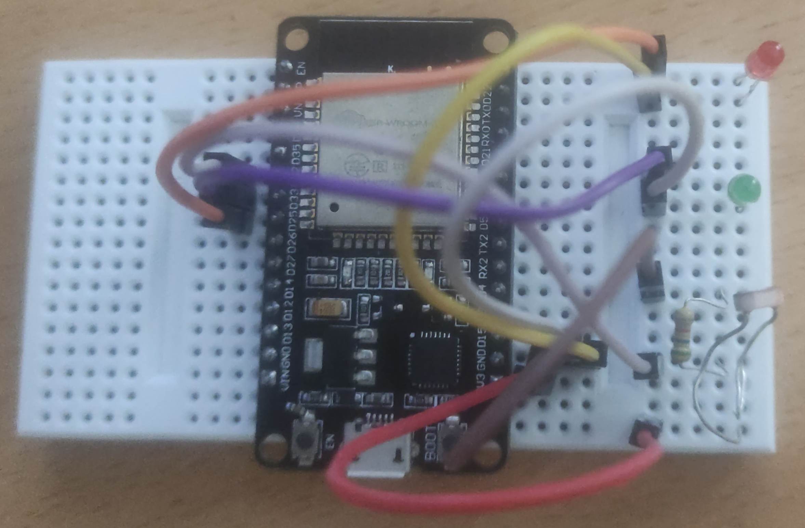
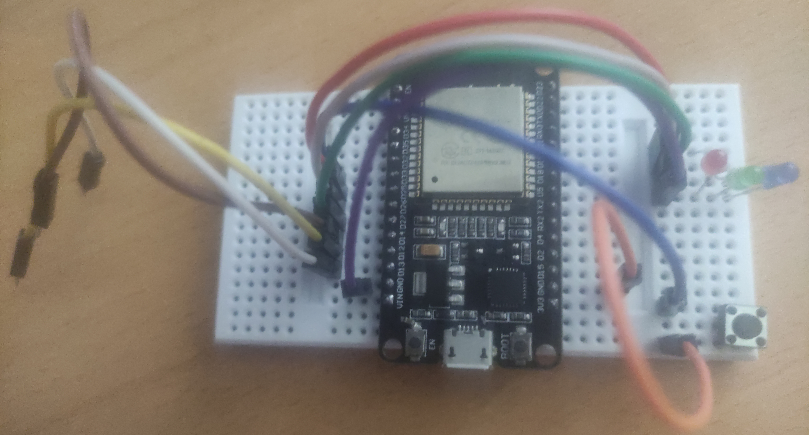
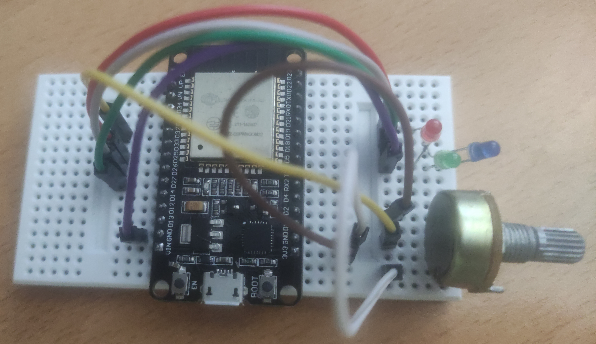

<div align="center">

  <h1>ISKS Seminar Project</h1>

  <p>
    Faculty of Information Studies<br/>
    <a href="https://www.fis.unm.si/">fis.unm.si</a>
  </p>

</div>

---

## Table of Contents

- [Task 1: Photoresistor](#task-1-photoresistor)
- [Task 2: Touch Sensors](#task-2-touch-sensors)
- [Task 3: Potentiometer](#task-3-potentiometer)

## Task 1: Photoresistor

**Pins used**
- Photoresistor sensor: GPIO 32
- Main LED: GPIO 33
- Backup LED: GPIO 25
- ESP LED: GPIO 2

<div align="center">
  
</div>

## Task 2: Touch Sensors

**Pins used**
- Touch Sensor 1: GPIO 13
- Touch Sensor 2: GPIO 12
- Touch Sensor 3: GPIO 14
- Push Button: GPIO 33

<div align="center">
  
</div>

## Task 3: Potentiometer

**Pins used**
- Potentiometer: GPIO 32
- Blue LED: GPIO 27
- Green LED: GPIO 26
- Red LED: GPIO 25

<div align="center">
  
</div>

## System Architecture

The system consists of
- **ESP32**
- **Web Control Panel (Next.js)**

## Communication

Messages are exchanged in JSON format over WebSocket

**Photoresistor (toggle LED):**
```json
{
  "name": "mainButton",
  "value": true
}
```
**Photoresistor (set threshold):**
```json
{
  "name": "threshold",
  "value": 1500
}
```
**Potentiometer (status):**
```json
{
  "name": "status",
  "value": "ok"
}
```
